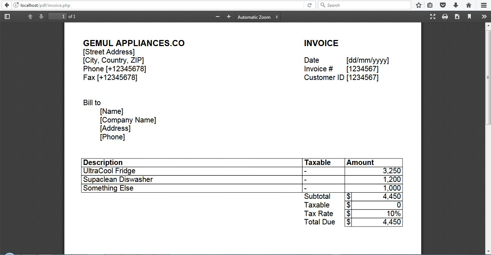
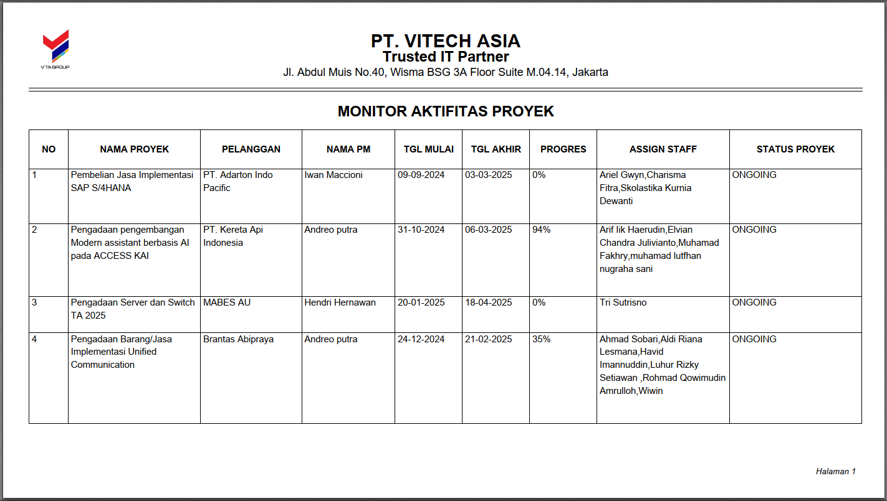
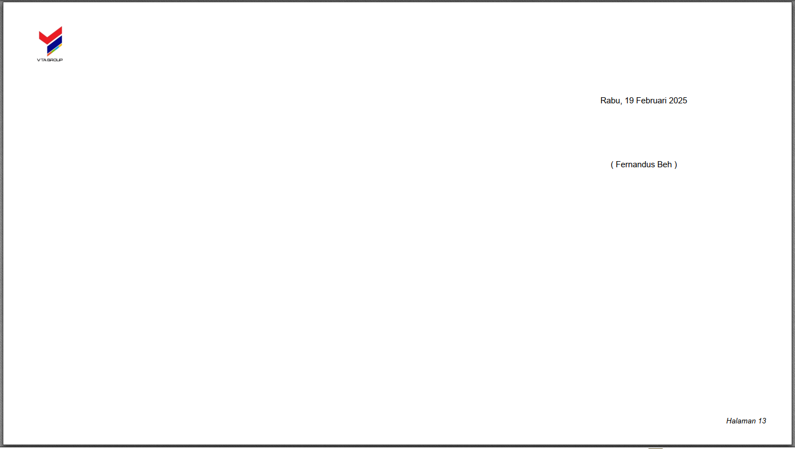

# **Materi Essential FPDF**  

## **1. Instalasi & Setup**
- **Unduh Library**: Download FPDF dari [situs resmi](http://fpdf.org/) (pastikan versi 1.8+)[Membuat File PDF dengan PHP dan Library FPDF - Tutup Kurung](https://www.tutupkurung.com/2018/01/membuat-file-pdf-dengan-php-dan-library.html)[Cara membuat file PDF di PHP menggunakan library FPDF - Asudahlah.com](http://id.asudahlah.com/2018/05/cara-membuat-file-pdf-di-php.html).
- **Integrasi ke Project**:
  1. Ekstrak file `.zip` yang diunduh.
  2. Salin file `fpdf.php` dan folder `font` ke direktori project (misal: `lib/fpdf/`)[Membuat File PDF dengan PHP dan Library FPDF - Tutup Kurung](https://www.tutupkurung.com/2018/01/membuat-file-pdf-dengan-php-dan-library.html).
  3. Pastikan struktur folder:
     ```
     📂 project/
        ├── 📄 index.php
        └── 📂 lib/
              └── 📂 fpdf/
                    ├── 📄 fpdf.php
                    └── 📂 font/
    ```

---

## **2. Membuat PDF Dasar** 
[Cara membuat file PDF di PHP menggunakan library FPDF - Asudahlah.com](http://id.asudahlah.com/2018/05/cara-membuat-file-pdf-di-php.html)[Membuat Laporan PDF dengan FPDF - 123dok](https://text-id.123dok.com/document/z3ew48dq-membuat-laporan-pdf-dengan-fpdf.html)
```php
<?php
// 1. Load library
require 'lib/fpdf/fpdf.php';

// 2. Inisialisasi objek PDF
$pdf = new FPDF('P', 'mm', 'A4'); // P=Portrait, mm=Milimeter, A4=Ukuran kertas

// 3. Tambahkan halaman
$pdf->AddPage();

// 4. Simpan atau tampilkan PDF
$pdf->Output('D', 'laporan.pdf'); // D=Download, I=Tampil di browser
?>
```
*Output*: File PDF kosong (siap diisi konten).

---

## **3. Menambahkan Konten**  
**Contoh: Membuat Header & Paragraf**
[Cara membuat file PDF di PHP menggunakan library FPDF - Asudahlah.com](http://id.asudahlah.com/2018/05/cara-membuat-file-pdf-di-php.html)[Step by Step PHP Membuat Laporan PDF dengan FPDF](https://issuu.com/achmatim/docs/step_by_step_php_membuat_laporan_pdf_dengan_fpdf)
```php
$pdf->SetFont('Arial', 'B', 16); // Font: Arial, Bold, 16pt
$pdf->Cell(0, 10, 'Laporan Keuangan 2024', 0, 1, 'C'); // Cell(lebar, tinggi, teks, border, newline, align)

$pdf->SetFont('Arial', '', 12);
$pdf->MultiCell(0, 8, 'Ini adalah contoh paragraf yang akan menyesuaikan lebar halaman secara otomatis.', 0);
```


---

## **4. Tabel dengan FPDF** 
[Cara membuat file PDF di PHP menggunakan library FPDF - Asudahlah.com](http://id.asudahlah.com/2018/05/cara-membuat-file-pdf-di-php.html)[Membuat Laporan PDF dengan FPDF - 123dok](https://text-id.123dok.com/document/z3ew48dq-membuat-laporan-pdf-dengan-fpdf.html)
```php
// Header Tabel
$pdf->SetFillColor(200, 220, 255); // Warna background
$pdf->Cell(40, 10, 'Nama Barang', 1, 0, 'C', true);
$pdf->Cell(30, 10, 'Harga', 1, 0, 'C', true);
$pdf->Cell(30, 10, 'Jumlah', 1, 1, 'C', true);

// Isi Tabel
$data = [
    ['Laptop', 'Rp 8.000.000', 5],
    ['Printer', 'Rp 1.200.000', 3]
];

foreach ($data as $row) {
    $pdf->Cell(40, 10, $row[0], 1);
    $pdf->Cell(30, 10, $row[1], 1, 0, 'R');
    $pdf->Cell(30, 10, $row[2], 1, 1, 'C');
}
```

---

## **5. Custom Header & Footer** 
[Step by Step PHP Membuat Laporan PDF dengan FPDF](https://issuu.com/achmatim/docs/step_by_step_php_membuat_laporan_pdf_dengan_fpdf)
```php
class CustomPDF extends FPDF {
    // Otomatis dipanggil tiap halaman
    function Header() {
        $this->Image('logo.png', 10, 6, 30); // Logo (path, x, y, width)
        $this->SetFont('Arial', 'B', 12);
        $this->Cell(0, 10, 'PT. Contoh Maju Jaya', 0, 1, 'R');
        $this->Ln(10); // Spasi
    }

    function Footer() {
        $this->SetY(-15); // Posisi 15mm dari bawah
        $this->SetFont('Arial', 'I', 8);
        $this->Cell(0, 10, 'Halaman ' . $this->PageNo(), 0, 0, 'C');
    }
}

// Gunakan class CustomPDF
$pdf = new CustomPDF();
```

---

## **6. Error Handling Umum**
- **File tidak terbuka**: Pastikan path file FPDF benar.  
  ```php
  require 'lib/fpdf/fpdf.php'; // ✅ Bukan 'fpdf17/fpdf.php' ❌
  ```
- **Font tidak terbaca**: Salin folder `font` ke direktori FPDF.
- **Output gagal**: Hindari `echo` atau HTML sebelum `Output()`.

---

## **Download Template Lengkap** 
[Cara membuat file PDF di PHP menggunakan library FPDF - Asudahlah.com](http://id.asudahlah.com/2018/05/cara-membuat-file-pdf-di-php.html)
```php
Contoh lengkap laporan invoice:  
https://github.com/rohmad-st/tutorial-fpdf/ (Folder: /example)
```

**[🚀 Tips]** Untuk font Bahasa Indonesia (Aksara Jawa/dll), gunakan `AddFont()` dengan ttf resmi. 

# Contoh Jadi


```php
//set font jadi arial, bold, 14pt
$pdf->SetFont('Arial','B',14);

//Cell(width , height , text , border , end line , [align] )

$pdf->Cell(130 ,5,'GEMUL APPLIANCES.CO',0,0);
$pdf->Cell(59 ,5,'INVOICE',0,1);//end of line

//set font jadi arial, regular, 12pt
$pdf->SetFont('Arial','',12);

$pdf->Cell(130 ,5,'[Street Address]',0,0);
$pdf->Cell(59 ,5,'',0,1);//end of line

$pdf->Cell(130 ,5,'[City, Country, ZIP]',0,0);
$pdf->Cell(25 ,5,'Date',0,0);
$pdf->Cell(34 ,5,'[dd/mm/yyyy]',0,1);//end of line

$pdf->Cell(130 ,5,'Phone [+12345678]',0,0);
$pdf->Cell(25 ,5,'Invoice #',0,0);
$pdf->Cell(34 ,5,'[1234567]',0,1);//end of line

$pdf->Cell(130 ,5,'Fax [+12345678]',0,0);
$pdf->Cell(25 ,5,'Customer ID',0,0);
$pdf->Cell(34 ,5,'[1234567]',0,1);//end of line

//buat dummy cell untuk memberi jarak vertikal
$pdf->Cell(189 ,10,'',0,1);//end of line

//alamat billing 
$pdf->Cell(100 ,5,'Bill to',0,1);//end of line

//tambah dummy cell di awal untuk indentasi
$pdf->Cell(10 ,5,'',0,0);
$pdf->Cell(90 ,5,'[Name]',0,1);

$pdf->Cell(10 ,5,'',0,0);
$pdf->Cell(90 ,5,'[Company Name]',0,1);

$pdf->Cell(10 ,5,'',0,0);
$pdf->Cell(90 ,5,'[Address]',0,1);

$pdf->Cell(10 ,5,'',0,0);
$pdf->Cell(90 ,5,'[Phone]',0,1);
 
//buat dummy cell untuk memberi jarak vertikal
$pdf->Cell(189 ,10,'',0,1);//end of line

//invoice 
$pdf->SetFont('Arial','B',12);

$pdf->Cell(130 ,5,'Description',1,0);
$pdf->Cell(25 ,5,'Taxable',1,0);
$pdf->Cell(34 ,5,'Amount',1,1);//end of line

$pdf->SetFont('Arial','',12);

//Angka diratakan kanan, jadi kita beri property 'R'

$pdf->Cell(130 ,5,'UltraCool Fridge',1,0);
$pdf->Cell(25 ,5,'-',1,0);
$pdf->Cell(34 ,5,'3,250',1,1,'R');//end of line

$pdf->Cell(130 ,5,'Supaclean Diswasher',1,0);
$pdf->Cell(25 ,5,'-',1,0);
$pdf->Cell(34 ,5,'1,200',1,1,'R');//end of line

$pdf->Cell(130 ,5,'Something Else',1,0);
$pdf->Cell(25 ,5,'-',1,0);
$pdf->Cell(34 ,5,'1,000',1,1,'R');//end of line

//total
$pdf->Cell(130 ,5,'',0,0);
$pdf->Cell(25 ,5,'Subtotal',0,0);
$pdf->Cell(4 ,5,'$',1,0);
$pdf->Cell(30 ,5,'4,450',1,1,'R');//end of line

$pdf->Cell(130 ,5,'',0,0);
$pdf->Cell(25 ,5,'Taxable',0,0);
$pdf->Cell(4 ,5,'$',1,0);
$pdf->Cell(30 ,5,'0',1,1,'R');//end of line

$pdf->Cell(130 ,5,'',0,0);
$pdf->Cell(25 ,5,'Tax Rate',0,0);
$pdf->Cell(4 ,5,'$',1,0);
$pdf->Cell(30 ,5,'10%',1,1,'R');//end of line

$pdf->Cell(130 ,5,'',0,0);
$pdf->Cell(25 ,5,'Total Due',0,0);
$pdf->Cell(4 ,5,'$',1,0);
$pdf->Cell(30 ,5,'4,450',1,1,'R');//end of line
```

# **Contoh Pada VTA_Apps : prj_monitoring_aktifitas_proyek.php**




```php
function print_report($id_pegawai, $tahun, $filter_proyek) 
    {
        // Load library PDF dan model
        $pdf    = $this->loadLibrary('fpdf3');
        $model  = $this->loadModel($this->model);
        
        // Ambil data user untuk tanda tangan
        $userid = $_SESSION['userid'];
        $id_pegawai_ttd = $model->getval('tuser', 'parent_id', 'user_id', $userid);
        // -------- Explaination --------
        $id = ($id_pegawai_ttd == null || $id_pegawai_ttd == ' ' || $id_pegawai_ttd == 0) ? 1 : $id_pegawai_ttd;
        // Jika $id_pegawai_ttd bernilai null, spasi, atau 0, maka $id akan diatur ke 1.
        // Jika tidak, $id akan diatur ke nilai $id_pegawai_ttd.
        
        // Ambil nama pegawai yang bertanda tangan
        $nama_pegawai = $model->get_nama($id);
        foreach ($nama_pegawai as $val) {
            $nama = $val['nm_pegawai'];
        }

        // ================ KONFIGURASI HALAMAN PDF ================
        $pdf->AddPage('L', 'A4');  // Landscape, ukuran A4
        // $pdf->setX(23);
        
        // Format tanggal dalam bahasa Indonesia
        $bulan = $pdf->getMonth(date('m'));
        $hari = [
            'Mon' => 'Senin', 'Tue' => 'Selasa', 'Wed' => 'Rabu',
            'Thu' => 'Kamis', 'Fri' => 'Jumat', 'Sat' => 'Sabtu', 
            'Sun' => 'Minggu'
        ][date('D')] ?? '';
        
        $tanggal_ttd = date('d');
        $tahun_ttd = date('Y');

        // ================ HEADER DAN JUDUL ================
        // $pdf->Image(...);  // Uncomment jika butuh logo
        $pdf->SetFont('Arial', 'B', 20);
        $pdf->Ln(-20); // Line Break Ke Atas
        $pdf->Cell(320, 10, 'PT. VITECH ASIA', 0, 1, 'C');
        $pdf->Ln(-4); // Line Break Ke Atas
        $pdf->SetFont('Arial', 'B', 16);
        $pdf->Cell(320, 10, 'Trusted IT Partner', 0, 1, 'C');
        $pdf->Ln(-4); // Line Break Ke Atas
        $pdf->SetFont('Arial', '', 12);
        $pdf->Cell(320, 10, 'Jl. Abdul Muis No.40, Wisma BSG 3A Floor Suite M.04.14, Jakarta', 0, 1, 'C');
        $pdf->Ln(-4); // Line Break Ke Atas
        
        // Garis pemisah header
        $pdf->Ln(5);
        $pdf->Cell(320, 0, '', 'B', 1, 'L');
        $pdf->Cell(320, 1, '', 'B', 1, 'L');
        $pdf->Ln(3);

        // ================ HEADER TABEL ================
        $pdf->SetFont('Arial', 'B', 16);
        $pdf->Cell(320, 10, 'MONITOR AKTIFITAS PROYEK', 0, 1, 'C');
        $pdf->SetFont('Arial', 'B', 10);
        $pdf->Ln(2);

        $headers = [
            'NO', 'NAMA PROYEK', 'PELANGGAN', 'NAMA PM', 
            'TGL MULAI', 'TGL AKHIR', 'PROGRES', 
            'ASSIGN STAFF', 'STATUS PROYEK'
        ];
        
        $widths = [15, 50.85, 38.85, 35.85, 25.85, 25.85, 25.85, 50.85, 50.85];
        $pdf->SetWidths($widths);
        
        foreach($widths as $key => $width) {
            if($key === count($widths) - 1) {
                // Elemen terakhir
                $pdf->Cell($width, 15, $headers[$key], 1, 1, 'C');
            } else {
                // Bukan elemen terakhir
                $pdf->Cell($width, 15, $headers[$key], 1, 0, 'C');
            }
        }

        // ================ QUERY DATA ================
        // Filter dinamis
        $where_proyek = ($filter_proyek != 'semua') ? "AND autocode = '$filter_proyek'" : "";
        $where_tahun = ($tahun != 'semua') ? "AND '$tahun' = SUBSTR(tanggal_kontrak_mulai,1,4)" : "";
        
        // Query utama
        $query = $model->query(
            "SELECT 
                autono, autocode, id_kontrak,
                IFNULL(nama_perusahaan,IFNULL(nama_perusahaan_bypass, '-')) AS nama_perusahaan,
                IFNULL(nama_instansi,'Belum Ditetapkan') AS nama_instansi,
                nomor_so, nama_project AS nama_kontrak,
                nilai_kontrak, tanggal_kontrak_mulai,
                tanggal_kontrak_selesai, nm_pegawai,
                IF(jumlah_total IS NULL OR jumlah_total = '',0,jumlah_total) as jumlah_total,
                GROUP_CONCAT(DISTINCT assign_staff) AS assign_staff
            FROM prj_penetapan_proyek a
                LEFT JOIN (SELECT autocode AS kd_sales_order, id_sq, id_customer, nomor_so, tanggal_mulai AS tanggal_kontrak_mulai, tanggal_selesai AS tanggal_kontrak_selesai, nilai_kontrak, nama_pekerjaan AS nama_kontrak, id_entitas, id_project FROM mkt_sales_order)b ON b.kd_sales_order = a.id_kontrak
                LEFT JOIN (SELECT autono AS kd_pgw, nm_pegawai FROM m_pegawai) c ON c.kd_pgw = a.id_pm
                LEFT JOIN (SELECT autono AS kd_sales_quo,parent_id AS id_leads,nama_pekerjaan AS nama_kontrak FROM mkt_sales_quotation ) d ON d.kd_sales_quo = b.id_sq
                LEFT JOIN (SELECT autono AS kd_leads, id_entitas FROM mkt_leads) e ON e.kd_leads = d.id_leads				  
                LEFT JOIN (SELECT autono AS kd_entitas, nama_perusahaan FROM m_entitas) f ON f.kd_entitas = e.id_entitas				  
                LEFT JOIN (SELECT autono AS kd_customer, id_instansi, id_kontak FROM mkt_customer) g ON b.id_customer = g.kd_customer
                LEFT JOIN (SELECT autono AS kd_kontak, id_instansi FROM m_kontak) h ON g.id_kontak = h.kd_kontak
                LEFT JOIN (SELECT autono AS kd_instansi, nama_instansi FROM m_instansi) i ON g.id_instansi = i.kd_instansi
                LEFT JOIN (SELECT id_penetapan_proyek, ROUND(SUM(progres_persentase)/ COUNT(progres_persentase)) AS jumlah_total FROM prj_aktifitas_proyek WHERE level_tree = 1 GROUP BY id_penetapan_proyek) j ON j.id_penetapan_proyek = a.autocode
                -- LEFT JOIN (SELECT id_penetapan_proyek AS kd_th, SUM(biaya) AS biaya_total FROM prj_tugas_harian GROUP BY id_penetapan_proyek) k ON k.kd_th = a.`autocode`
                LEFT JOIN (SELECT autono AS kd_entitas_bypass, nama_perusahaan AS nama_perusahaan_bypass FROM m_entitas) l ON l.kd_entitas_bypass = b.id_entitas
                LEFT JOIN (SELECT autono AS autopro,nama_project FROM m_project) az ON az.autopro = b.id_project
                LEFT JOIN (SELECT id_penetapan_proyek AS kd_staff1, autocode AS au_staff1 FROM prj_aktifitas_proyek) a_staff1 ON kd_staff1 = a.`autocode`
                LEFT JOIN ( SELECT parent_id AS kd_staff2, id_pegawai FROM prj_multiple_akt_pic) a_staff2 ON kd_staff2 = au_staff1
                LEFT JOIN (SELECT autono AS kd_staff3, nm_pegawai AS assign_staff FROM m_pegawai)a_staff3 ON kd_staff3 = a_staff2.id_pegawai
            WHERE 1=1 $where_tahun $where_proyek
            GROUP BY a.`autocode`
            ORDER BY LENGTH(autocode) DESC, autocode DESC
        ");

        // ================ BODY TABEL ================
        $no = 1;
        $pdf->SetFont('Arial', '', 10);
        
        foreach ($query as $row) {
            // Tentukan status proyek
            $isInternal = strpos(strtolower($row['nama_instansi']), 'internal') !== false;
            $status = ($row['tanggal_kontrak_selesai'] < date('Y-m-d')) ? 'CLOSED' : 'ONGOING';
            $status .= $isInternal ? ', INTERNAL' : '';

            // Baris tabel
            $pdf->Row([
                $no++,
                $row['nama_kontrak'],
                $row['nama_instansi'],
                $row['nm_pegawai'],
                date('d-m-Y', strtotime($row['tanggal_kontrak_mulai'])),
                date('d-m-Y', strtotime($row['tanggal_kontrak_selesai'])),
                $row['jumlah_total'] . '%',
                $row['assign_staff'],
                $status,
            ]);
        }

        // ================ PENUTUP ================
        $pdf->TandaTangan($hari, $tanggal_ttd, $bulan, $tahun_ttd, $nama);
        $pdf->Output();
    }
```

### Penjelasan Segmen Utama:

1. **Inisialisasi & Setup Awal**  
   - Memuat library PDF dan model database  
   - Mengambil data penanda tangan dari session  
   - Penanganan fallback ID jika data tidak tersedia

2. **Struktur Dasar PDF**  
   - `AddPage('L', 'A4')`: Membuat halaman landscape A4  
   - Pengaturan format tanggal Indonesia  
   - Penggunaan `SetFont()` dan `Cell()` untuk layouting teks

3. **Header Laporan**  
   - Judul utama dan subjudul  
   - Garis pemisah dekoratif dengan `Cell()`  
   - (Opsional) Uncomment bagian `Image()` untuk menambahkan logo

4. **Tabel Data**  
   - `SetWidths()`: Mendefinisikan lebar kolom  
   - Header tabel dengan warna background  
   - Query SQL dinamis dengan filter tahun dan proyek

5. **Body Data Dinamis**  
   - Perulangan data hasil query  
   - Logika penentuan status proyek (CLOSED/ONGOING)  
   - Formatting tanggal dan persentase progres

6. **Penutup Dokumen**  
   - Memanggil method `TandaTangan()` untuk bagian tanda tangan  
   - `Output()`: Generate file PDF akhir

### Fitur Penting:
```javascript
1. **Dynamic Filtering**  
   - Filter tahun: `WHERE SUBSTR(tanggal_kontrak_mulai,1,4) = ?`  
   - Filter proyek: `WHERE autocode = ?`

2. **Status Cerdas**  
   ```php
   $status = ($tanggal_selesai < hari_ini) ? 'CLOSED' : 'ONGOING';
   $status .= (contains 'internal') ? ', INTERNAL' : '';
   ```

3. **Auto Width Adjustment**  
   `SetWidths()` untuk pengaturan lebar kolom otomatis

4. **Safety Feature**  
   - Penanganan null value dengan `IFNULL()`  
   - Validasi data angka dengan `number_format()` 